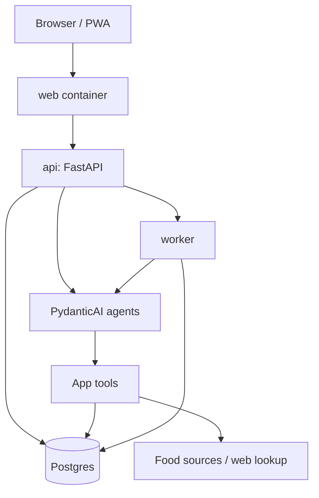

# Health Monitor Architecture Design

Status: Draft, updated for `agent-first-plan.md`
Created: 2026-07-01

Current product shape: an agent-first chat, proposal-gated writes, and separate data
inspection pages. `docs/agent-first-plan.md` supersedes any older routing direction
that says deterministic natural-language classifiers should run before the model.

## Architecture Goals

The system should be easy to deploy as a self-contained private app on TrueNAS using Docker. It should not assume cloud infrastructure, managed queues, managed databases, or hosted object storage.

Primary goals:

- Keep the app deployable as one Docker Compose stack.
- Keep durable health, nutrition, attachment, import, and agent data inside Postgres by default.
- Use PydanticAI for the agent layer instead of building a large custom agent runtime.
- Keep calculations deterministic and testable.
- Keep agent writes proposal-gated.
- Support food lookup, label parsing, aliases, corrections, recipes, weight logs, and reviews from the start of the design.
- Make backup and restore straightforward.

Non-goals for the first architecture:

- Public multi-tenant SaaS.
- App store deployment.
- Kubernetes.
- Separate object storage service unless Postgres storage becomes a proven bottleneck.
- Separate queue/cache service unless background work needs it.
- Clinical or medical decision support.

## Deployment Model

Target deployment: one TrueNAS-hosted Docker Compose application.

Recommended services:

- `web`: serves the frontend and is the public entrypoint.
- `api`: FastAPI backend, domain services, REST API, streaming chat endpoints, and PydanticAI agents.
- `worker`: background worker using the same image as `api`.
- `db`: Postgres.

Persistent resources:

- Postgres data volume.
- Optional backup output bind mount or volume.

The worker should be part of the day-one deployment. OCR, import parsing, long lookups, research-agent jobs, export generation, and retryable agent tasks should not be designed around blocking HTTP requests.

Recommended TrueNAS shape:

- One dataset for the app deployment.
- One child dataset or mounted path for Postgres data.
- One optional child dataset or mounted path for logical backups.
- TrueNAS/ZFS snapshots for volume-level recovery.
- Optional app-triggered Postgres dumps for easier logical restore.

The app should expose one HTTP port from `web`. The `api` and `db` services should stay private on the Compose network unless there is a specific debugging need.

## Service Topology



## Service Responsibilities

### Web

The web service owns the user interface.

Expected responsibilities:

- Full-screen agent chat as the primary screen.
- URL-addressable inspection pages: Chat, Painel, Dados, Ajustes.
- Painel: day card, weekly and rolling summaries, calorie and weight trends.
- Dados: raw diary, weight, food/version, proposal, job, and chat-turn tables.
- Food library and evidence inspection.
- Recipe/library inspection.
- Weight log inspection and edits.
- Proposal review, confirmation, rejection, and audit details.
- Settings, outbox, background jobs, import/export.

Implementation direction:

- Vite SPA as the default first frontend.
- Avoid Next.js for the first version.
- Web-first, mobile-friendly.
- PWA support is a first-class goal, especially installability and offline-tolerant daily logging.
- Static assets served by `web`.
- `/api/*` and chat streaming requests proxied from `web` to `api`.

Architecture boundary:

- The frontend never receives model provider API keys.
- The frontend may expose advanced per-run agent settings such as model, effort, max tool loops, and lookup depth for early tuning.
- The frontend does not calculate canonical nutrition totals.
- The frontend can display optimistic previews, but the backend owns persisted calculations.

### API

The API service is the main application service.

Expected responsibilities:

- Authentication/session handling.
- Person and household context.
- Food library APIs.
- Diary APIs.
- Recipe APIs.
- Weight APIs.
- Review APIs.
- Proposal APIs.
- Attachment upload/download.
- Import/export APIs.
- Agent chat and streaming endpoints.
- External lookup orchestration.

Implementation direction:

- Python.
- FastAPI.
- Pydantic models for API schemas.
- SQLAlchemy or SQLModel for persistence.
- Alembic for migrations.
- PydanticAI for agents and structured outputs.

Architecture boundary:

- The API applies mutations through domain services.
- The API does not let agent tool output write directly to tables.
- All write paths should be usable without the agent.

### Worker

The worker is part of the deployable shape from day one.

Expected responsibilities:

- Parse large imports.
- Run OCR or image preprocessing.
- Run long food lookups.
- Run controlled research-agent lookups.
- Generate exports.
- Recompute cached summaries if needed.
- Maintain Postgres-backed lookup caches and agent memory records.

Implementation direction:

- Same Docker image as `api`.
- Different command, for example `health-monitor worker`.
- Postgres-backed job table.

Architecture boundary:

- Avoid Redis or a separate cache service until there is a concrete need.
- Cache, retry state, lookup memory, and self-organization memory should live in Postgres first.
- Jobs should be idempotent where practical.
- Job output should be recorded as structured records or proposals.

### Database

Postgres is the durable source of truth.

Expected responsibilities:

- Households and people.
- Goal profiles.
- Foods, food versions, aliases, and resolution signals.
- Barcode associations.
- Diary entries.
- Recipes and recipe versions.
- Weight entries.
- Attachments metadata.
- Agent runs and tool calls.
- Proposals and proposal applications.
- Review notes.
- Import/export manifests.
- Attachment blobs and source artifacts.
- Job queue and retry state.
- Lookup caches and agent memory records.

Architecture boundary:

- Use migrations for every schema change.
- Keep attachment and artifact data in dedicated tables so backup criticality and retention policy are explicit.
- Store content hashes, MIME types, sizes, and source links for all binary objects.
- Use streaming endpoints for large downloads/uploads rather than loading full blobs into application memory.

### Object And Artifact Storage

The app stores binary objects in Postgres by default. This keeps the deployment tight: one primary data volume, one database backup strategy, and straightforward cross-references from diary entries, food versions, proposals, and agent runs.

Expected stored objects:

- Nutrition label images.
- Meal photos, when supported.
- OCR intermediate files.
- ChatGPT export files, if the user uploads them into the app.
- Generated exports.
- Private generated fixtures, if intentionally stored.

Recommended table split:

```text
attachment_objects       binary objects linked to app records
source_artifacts         raw imports, OCR text, source pages, research outputs
generated_exports        exported app data archives
object_derivatives       thumbnails, OCR derivatives, normalized text extracts
```

Recommended object metadata:

- `id`
- `object_type`
- `mime_type`
- `byte_size`
- `sha256`
- `storage_status`
- `created_at`
- `created_by_person_id`
- `retention_policy`
- `linked_record_type`
- `linked_record_id`

Tradeoffs:

- Backups are simpler because Postgres contains the full application state.
- Cross-references and audit trails are easier.
- Database size will grow with images and imports.
- Logical dumps may become large; TrueNAS/ZFS snapshots become more important.
- If media grows too much, the storage interface should allow moving blobs to filesystem/object storage later without changing domain records.

The repository should not contain private imports or attachments. Local import folders are ignored by git.

## Application Module Boundaries

Recommended backend layout:

```text
app/
  api/
    routes/
    dependencies.py
  agents/
    nutrition_agent.py
    tools.py
    proposals.py
    evals/
  domain/
    diary.py
    foods.py
    food_resolution.py
    recipes.py
    goals.py
    weights.py
    reviews.py
    proposals.py
    nutrients.py
  persistence/
    models.py
    repositories.py
    migrations/
  lookup/
    local.py
    open_food_facts.py
    usda.py
    web.py
    research_agent.py
  imports/
    chatgpt_html.py
    fixtures.py
  attachments/
    objects.py
    ocr.py
  jobs/
    queue.py
    worker.py
  memory/
    lookup_cache.py
    agent_memory.py
```

Important boundary:

- `domain/` owns business rules.
- `agents/` may draft proposals but should not own persistence rules.
- `lookup/` returns candidate evidence, not diary entries.
- `api/` should stay thin.

## Agent Architecture

Use PydanticAI as the agent runtime.

Agent responsibilities:

- Interpret user chat turns and prompt-builder messages.
- Ask clarifying questions in the thread when the user intent or required fields are ambiguous.
- Extract structured tool arguments from natural language.
- Resolve food references using tools.
- Request external lookup when local matching is weak.
- Run targeted label OCR on uploaded attachments when needed.
- Draft meal, amendment, range-estimate, recipe, food-version, correction, profile, goal, onboarding, and review-note proposals.
- Log chat weight measurements through the explicit `log_weight` tool.
- Answer free-form questions over app data.

Agent dependencies:

- Active household and person.
- Timezone and current date.
- Domain service interfaces.
- Lookup service interfaces.
- Source configuration.
- Model/provider configuration.
- Per-run agent settings selected by the user or default policy.

Agent tools:

- `day_summary`
- `week_summary`
- `weight_trend`
- `resolve_food`
- `lookup_food`
- `search_foods`
- `get_food_details`
- `list_open_proposals`
- `food_version_history`
- `extract_label_text_from_attachment`
- `draft_meal_proposal`
- `amend_meal_proposal`
- `log_weight`
- `repeat_meal`
- `draft_range_estimate`
- `draft_recipe_proposal`
- `draft_diary_correction_proposal`
- `draft_review_note_proposal`
- `draft_profile_update_proposal`
- `draft_goal_profile_proposal`
- `draft_onboarding_proposal`

Tool design rules:

- Read tools can be broad.
- Write-like tools return proposals, not durable records.
- `log_weight` is the single sanctioned direct-write agent tool because a weight measurement is already a structured number.
- Meal tools accept structured arguments extracted by the model. They must not call raw user-text parsers.
- Tool results include source IDs and confidence where relevant.
- Food lookup tools preserve source metadata.
- Model estimates are labeled as estimates.
- Every tool call should leave an audit trail with agent run ID, tool name, input summary, output summary, source record IDs, timing, status, and error details when applicable.

### Agent Chat Flow

The primary write intent path is:

```text
user message or prompt-builder message
  -> POST /api/agent/chat or /api/agent/chat/stream
  -> REQUIRE_MODEL gate for pydantic-ai settings
  -> context builder
     - person and active goal
     - last chat turns
     - open proposals
     - recent day summaries, with older days pruned
  -> PydanticAI agent loop
     - read tools
     - clarify in plain chat
     - or call draft/direct tools
  -> persisted chat turn
  -> optional proposal id
```

Important routing rules:

- No deterministic natural-language branch decides what a chat message means.
- The deterministic runtime is a test double only, not a model-backed fallback.
- If `REQUIRE_MODEL` is enabled and the configured model is unavailable, chat fails with a 503-style model-unavailable response and a replay message.
- If `REQUIRE_MODEL` is disabled and pydantic-ai fails, chat answers that the configured agent did not return a result; it does not silently draft proposals with regex parsing.
- Prompt-builder modals compose readable chat messages plus optional `intent`; they do not call dedicated draft endpoints.

Streaming chat uses Server-Sent Events:

- `tool_call`
- `text_delta`
- `final`

The non-stream endpoint remains for jobs, tests, and simple integrations.

### Agent Runtime Settings

Early versions should expose advanced per-run controls in the UI because practical tuning will matter.

Allowed UI knobs:

- Model/provider profile.
- Effort level.
- Maximum tool-call loops.
- Lookup depth.
- Whether external lookup is allowed for this run.
- Whether controlled research-agent lookup is allowed for this run.

Rules:

- API keys never leave the backend.
- UI-selected model profiles map to backend-defined provider settings.
- Per-run settings are stored on `AgentRun`.
- Defaults should be safe and low-friction.
- Advanced settings should be visible enough for iteration, but not required for normal family use.

## Proposal-Gated Writes

Agent-created changes go through proposals.

Flow:

1. User sends a chat message, a prompt-builder message, or an onboarding message.
2. Agent uses tools and either asks a clarifying question or returns a structured proposal.
3. Backend validates proposal payload with domain models.
4. UI shows proposal preview inline or in proposal/detail surfaces.
5. User confirms, edits, resolves clarification candidates, or rejects.
6. Backend applies confirmed proposal through domain services.
7. Application stores proposal status, applied records, chat run, tool calls, and audit metadata.

Direct manual writes still go through domain services, but they do not need an agent proposal.

Examples:

- Manual diary entry: direct domain write.
- Agent meal parse: proposal, then domain write after confirmation.
- Agent meal amendment: new proposal supersedes the old draft, then domain write after confirmation.
- Agent correction: proposal, then domain write after confirmation.
- Label scan: proposal for food/version creation.
- Recipe parse: proposal for recipe version creation.
- Onboarding: proposal for household/person/goal setup, then creation on confirmation.

## Food Resolution Architecture

The app should distinguish internal identity from user-facing references.

Core records:

- `Food`: stable food identity.
- `FoodVersion`: immutable nutrient profile.
- `FoodAlias`: user-facing phrase or nickname.
- `BarcodeAssociation`: barcode mapping to food and food version.
- `FoodResolutionSignal`: evidence used to rank a phrase against a food/version.

Resolution inputs:

- User phrase.
- Active person.
- Recent diary entries.
- Default food versions.
- Alias matches.
- Barcode associations.
- Label scan history.
- Barcode/brand/product metadata.
- User correction history.

Resolution output:

- Candidate food.
- Candidate food version.
- Match reason.
- Confidence.
- Whether clarification is needed.

User-facing labels:

- Brand and food name.
- Variant.
- Label date.
- Barcode, when useful.
- "current default".
- "last used yesterday".
- "from label scanned this week".

Avoid user-facing labels such as "Yogurt v17" as the primary interface.

### Barcode Association Architecture

Barcode evidence should become a durable local matching signal.

Flow:

1. User scans a nutrition label and barcode for a product.
2. Agent/parser extracts nutrients and product identity.
3. Backend creates a proposal containing a food, food version, and barcode association.
4. User confirms the proposal.
5. Future barcode scans resolve to the local association before external lookup.

Rules:

- A barcode association can point to both `Food` and `FoodVersion`.
- If the same barcode later appears with a changed nutrition label, create a new `FoodVersion` and update the active barcode association after confirmation.
- Existing diary entries keep their historical food version.
- Barcode association history should preserve first seen, last seen, source attachment, and confirmation metadata.
- External barcode lookup results should not override confirmed local associations without user confirmation.

## Food Lookup Architecture

Lookup source order should be configurable, but the default should be:

1. Local food library.
2. Food aliases and resolution signals.
3. Local barcode associations.
4. Open Food Facts for packaged/barcoded products, with Brazil context.
5. Brazilian composition/reference datasets for generic foods.
6. USDA FoodData Central as a fallback, especially when no Brazilian source is available.
7. Controlled web lookup.
8. Controlled research-agent lookup.
9. Model estimate.

Brazil-first source notes:

- Open Food Facts should be the first external source for packaged foods because it supports barcode/product lookup and is globally scoped, including Brazilian products. Its API docs emphasize custom user agents, rate limits, v3 for new integrations, and that data is user-contributed and not guaranteed complete or accurate.
- TBCA should be considered the primary Brazilian generic-food composition reference. It is a Brazilian food composition database with searchable composition resources, but we should verify download/API/licensing details before automating ingestion.
- IBGE POF 2008-2009 nutrition composition tables are relevant Brazilian reference data for foods consumed in Brazil and include nutrients per 100 g edible portion. They are better treated as imported/reference datasets than live API lookups.
- USDA FoodData Central remains useful, but it should not outrank Brazilian sources for local foods when a Brazilian source exists.
- Restaurant chains in Brazil likely require controlled web or research-agent lookup because there is no obvious universal nutrition API for regional menu items.

Reference pages checked:

- Open Food Facts API: `https://openfoodfacts.github.io/openfoodfacts-server/api/`
- TBCA: `https://www.tbca.net.br/`
- IBGE POF 2008-2009 nutrition composition tables: `https://biblioteca.ibge.gov.br/visualizacao/livros/liv50002.pdf`

Lookup output should normalize candidates into a shared shape:

- Source type.
- Source name.
- Source URL or source ID.
- Product name.
- Brand.
- Barcode.
- Barcode association ID, when local.
- Serving basis.
- Nutrients.
- Confidence.
- Warnings.
- Raw source payload reference.

The selected candidate can become a local `FoodVersion` after user confirmation.

## Controlled Research-Agent Lookup

Controlled research-agent lookup is a fallback source adapter for hard cases such as regional restaurant meals.

Example:

```text
Research nutritional references for a KFC Double Crunch combo in Brazil.
Return official sources first, third-party sources next, extracted item assumptions,
calorie/macro ranges, and uncertainty.
```

Rules:

- It is optional and configurable.
- It does not write diary data.
- It returns evidence and extracted claims.
- The nutrition agent or user still decides how to use those claims.
- The final logged meal remains a confirmed proposal.

Implementation can start as a manual/offline adapter and later become an automated local command runner if it is valuable.

## Import Architecture

Imports are evidence-first, but not a major product surface for the MVP.

Supported import targets:

- One-off ChatGPT HTML/Canvas export import.
- App structured export.
- Future health data exports.

Preferred first import flow:

1. Keep raw export files outside git.
2. Run one-off admin/import scripts locally.
3. Generate candidate records, aliases, and test fixtures.
4. Review candidates manually.
5. Insert confirmed records with temporary database access or an admin-only command.

The app does not need a polished generic import UI early. The parser should be able to generate sanitized test fixtures without writing app records.

## API Shape

Initial route groups:

```text
/api/health
/api/session
/api/households
/api/people
/api/goals
/api/foods
/api/food-versions
/api/food-aliases
/api/barcodes
/api/diary
/api/recipes
/api/weights
/api/summaries
/api/proposals
/api/agent/chat
/api/agent/chat/stream
/api/agent/onboarding-chat
/api/agent/onboarding-history
/api/attachments
/api/imports
/api/exports
/api/settings
```

Streaming chat can use Server-Sent Events first. WebSockets can be added later if bidirectional streaming becomes necessary.

Legacy prompt-builder draft endpoints such as `/api/agent/text-meal`,
`/api/agent/label-scan`, `/api/agent/recipe`, and the old direct
`/api/diary/repeat` shortcut are not part of the current HTTP surface.
Dedicated UI helpers compose messages for `/api/agent/chat` instead.

## Authentication And Access

This is a private household app, not a public SaaS.

MVP approach:

- Household login with multiple day-one person profiles.
- Simple local admin account for setup and maintenance.
- Session cookie auth.
- Optional reverse proxy authentication outside the app.
- No provider API keys in the browser.
- Fast profile switching for family use.

Future:

- Stronger account model if exposed beyond the private network.

## Configuration

Configuration should come from environment variables and mounted secrets.

Expected settings:

```text
DATABASE_URL
APP_SECRET_KEY
APP_BASE_URL
OBJECT_STORAGE_BACKEND=postgres
MODEL_PROVIDER
DEFAULT_MODEL_PROFILE
DEFAULT_AGENT_EFFORT
DEFAULT_MAX_TOOL_LOOPS
LOG_FORMAT=json
LOG_LEVEL
NEXUSLOG_ENABLED
NEXUSLOG_MODE
NEXUSLOG_URL
NEXUSLOG_TOKEN
NEXUSLOG_JSONL_PATH
OLLAMA_BASE_URL
OLLAMA_API_KEY
OPENFOODFACTS_ENABLED
USDA_ENABLED
USDA_API_KEY
BRAZILIAN_REFERENCE_DATASETS_ENABLED
WEB_LOOKUP_ENABLED
RESEARCH_AGENT_LOOKUP_ENABLED
CLOUD_MODEL_CALLS_ENABLED
```

Configuration rules:

- Defaults should work for local development.
- Cloud calls should be disableable.
- External lookup sources should be independently disableable.
- Missing optional keys should degrade the app instead of crashing startup.

## Networking

The deployment should use a simple edge shape:

```text
browser -> web container -> api container -> db container
```

Rules:

- Expose only `web` to the host by default.
- Keep `api` private to the Docker network.
- Keep `db` private to the Docker network.
- Let the user's existing reverse proxy, Tailscale, VPN, or TrueNAS networking expose the `web` port if desired.
- Avoid CORS complexity by serving the frontend and proxying `/api` from the same origin.

## Docker Compose Shape

Illustrative service layout:

```yaml
services:
  web:
    image: health-monitor-web
    ports:
      - "8080:80"
    depends_on:
      - api

  api:
    image: health-monitor-api
    env_file: .env
    environment:
      LOG_FORMAT: json
      NEXUSLOG_MODE: stdout
    depends_on:
      - db

  worker:
    image: health-monitor-api
    command: ["health-monitor", "worker"]
    env_file: .env
    environment:
      LOG_FORMAT: json
      NEXUSLOG_MODE: stdout
    depends_on:
      - db

  db:
    image: postgres:17
    environment:
      POSTGRES_DB: health_monitor
      POSTGRES_USER: health_monitor
      POSTGRES_PASSWORD: change_me
    volumes:
      - postgres:/var/lib/postgresql/data
      - backups:/backups

volumes:
  postgres:
  backups:
```

This is not final compose syntax. It defines the service shape we should preserve.

For local Ollama, prefer treating Ollama as an external dependency first. If running Ollama inside this stack becomes useful later, add an optional `ollama` profile instead of making every deployment carry it.

For NexusLog/LogLens, prefer stdout ingestion first. If JSONL tailing is used for development, add a bind mount such as `./var/nexuslog-events:/app/var/nexuslog-events` and set `NEXUSLOG_MODE=jsonl` plus `NEXUSLOG_JSONL_PATH`.

## Backup And Restore

Backups primarily need Postgres because application data, attachments, imports, exports, jobs, and audit trails live there by default.

Minimum backup set:

- Postgres dump.
- Postgres data volume snapshots.
- `.env` or secrets backup stored outside the repo.

Recommended app-level export:

- Foods and versions.
- Aliases and resolution signals.
- Diary entries.
- Recipes.
- Weights.
- Goals.
- Proposals and review notes.
- Attachment metadata.
- Attachment objects or object references.

Raw attachment objects may be exported as a separate archive for portability, but the primary copy remains in Postgres.

TrueNAS can cover volume-level recovery with snapshots, but logical Postgres dumps are still useful because they are portable and easier to inspect. The deployment should eventually include a simple backup command or optional backup job that writes timestamped dumps to `/backups/`.

## Observability

Keep observability simple and useful. The app should be designed to integrate with NexusLog/LogLens, the homelab logging service.

Minimum:

- Structured JSON logs to stdout.
- Request IDs.
- Agent run IDs.
- Tool call logs.
- Proposal application logs.
- Job status records.
- Durable audit tables in Postgres for agent runs, tool calls, proposal decisions, external lookup source use, and object access.

Avoid logging:

- Provider API keys.
- Full private diary content by default.
- Uploaded image contents.

Debug mode can log more detail locally, but it should be explicit.

External logging service:

- The architecture should support forwarding structured app and agent events to NexusLog/LogLens.
- The app should keep its own minimal Postgres audit trail even when external logging is enabled.
- The external logging integration should be optional and independently disableable.

### NexusLog Integration

NexusLog is not part of the core Health Monitor Compose stack by default. It should be treated as an existing homelab service that can ingest Health Monitor events through one of three modes:

- Docker stdout collection: default production-friendly mode, zero app-specific network integration.
- JSONL tailing: good for local development, tests, and higher-volume structured event capture.
- HTTP `POST /api/events`: good for low-volume server-side events.

The app should have a small logging adapter that can emit the same canonical event shape to stdout, JSONL, or HTTP.

Canonical event shape:

```json
{
  "ts": "2026-07-01T12:00:00.000Z",
  "service": "health-monitor-api",
  "level": "info",
  "event": "proposal.applied",
  "entity_type": "proposal",
  "entity_id": "prop_123",
  "request_id": "req_abc",
  "session_id": "sess_abc",
  "job_id": "job_abc",
  "payload": {
    "message": "Proposal applied",
    "proposal_id": "prop_123",
    "person_id": "person_123",
    "duration_ms": 42
  }
}
```

Required fields:

- `ts`
- `service`
- `level`
- `event`

Allowed levels:

- `debug`
- `info`
- `warn`
- `error`

Correlation fields:

- `entity_type`
- `entity_id`
- `request_id`
- `session_id`
- `job_id`
- payload fields ending in `_id`

Service names:

- `health-monitor-web`
- `health-monitor-api`
- `health-monitor-worker`

Important event families:

- `app.started`
- `api.request.completed`
- `api.request.failed`
- `agent.run.started`
- `agent.run.completed`
- `agent.run.failed`
- `agent.tool.started`
- `agent.tool.completed`
- `agent.tool.failed`
- `proposal.created`
- `proposal.confirmed`
- `proposal.applied`
- `proposal.rejected`
- `job.enqueued`
- `job.started`
- `job.completed`
- `job.failed`
- `lookup.started`
- `lookup.completed`
- `lookup.failed`
- `object.created`
- `object.accessed`
- `import.parsed`
- `export.generated`

Payload rules:

- Put human-readable text in `payload.message`.
- Put timings in `duration_ms`.
- Put HTTP status in `status_code`.
- Put errors in `error`, `error_type`, and `stack` only when safe.
- Put IDs in explicit `*_id` fields.
- Do not put provider API keys, auth cookies, raw images, full diary content, or full model prompts in NexusLog payloads.
- Prefer summaries, hashes, counts, record IDs, and source IDs over private raw content.

MCP debugging:

- When NexusLog MCP is configured, use the `nexuslog-assistant` skill to inspect runtime behavior.
- Start with `nexuslog_health`, `nexuslog_schema`, and `nexuslog_services`.
- Use bounded read-only SQL through `nexuslog_sql`.
- Follow timelines through `request_id`, `session_id`, `job_id`, `agent_run_id`, `proposal_id`, and `person_id`.
- Never print NexusLog tokens.

## Testing Architecture

The architecture should support tests before implementation.

Test layers:

- Unit tests for nutrient math, unit conversion, target selection, and food version immutability.
- Domain service tests for diary writes, proposal application, recipe calculation, and food resolution.
- Lookup adapter tests with recorded fixtures.
- PydanticAI agent fixture tests for meal parsing, corrections, and reviews.
- Import parser tests using sanitized ChatGPT export fixtures.
- API tests for route contracts.
- End-to-end tests for meal logging and confirmation.

Important principle:

- Agent tests should assert proposal shape and tool usage, not exact prose.

## Initial Implementation Slices

Build in thin vertical slices.

### Slice 1: Core Data And Manual Diary

- Person and goal profile.
- Food and food version.
- Diary entry.
- Deterministic macro totals.
- Manual diary APIs.

### Slice 2: Food Resolution

- Food aliases.
- Resolution signals.
- Candidate ranking.
- Correction feedback.

### Slice 3: Proposal System

- Proposal model.
- Preview and confirmation.
- Transactional application.
- Rejection audit.

### Slice 4: Agent Meal Logging

- PydanticAI nutrition agent.
- Food search and resolution tools.
- External lookup stub.
- Meal proposal output.

### Slice 5: Label/Table Parsing

- Attachment upload.
- OCR/text input.
- Food version proposal.
- Evidence records.

### Slice 6: Reviews And Import Fixtures

- Weekly summaries.
- Agent explanation over deterministic totals.
- ChatGPT import parser fixtures.

## Open Architecture Decisions

- Which Vite UI framework should be used?
- Should the first API use SQLAlchemy or SQLModel?
- Should OCR start as model-vision-only, OCR-plus-agent, or both?
- Which Brazil-first lookup adapter should be implemented first after local library and Open Food Facts?
- What size threshold should trigger reconsidering Postgres blob storage?
- What advanced agent knobs should be visible to normal family users versus admin/developer users?
- Should backups be app-triggered or left to TrueNAS/ZFS plus Postgres dump jobs?
- What logging service event schema should the external observability integration use?
